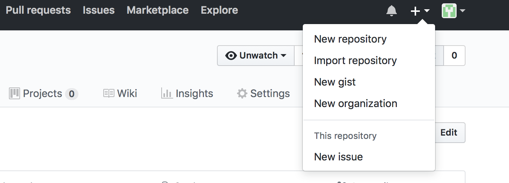
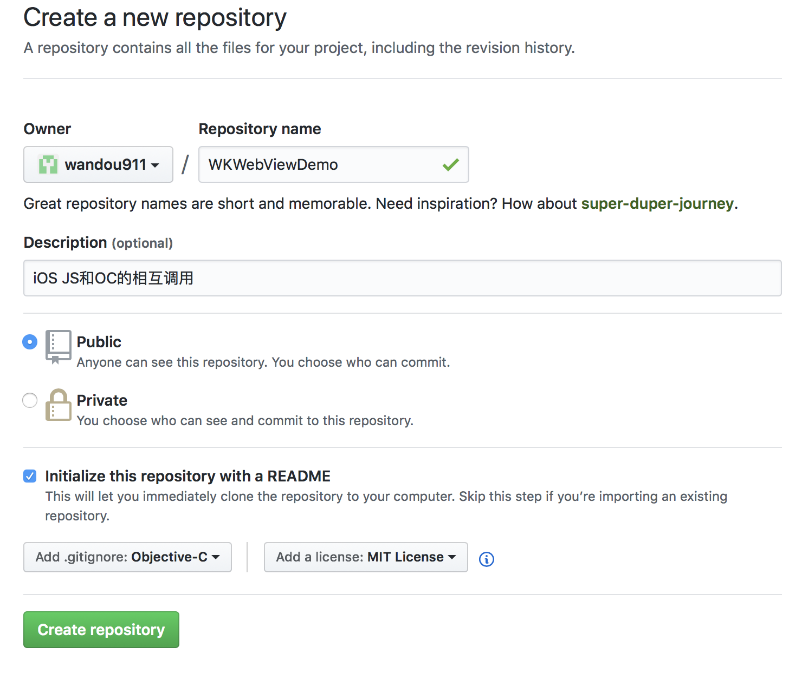
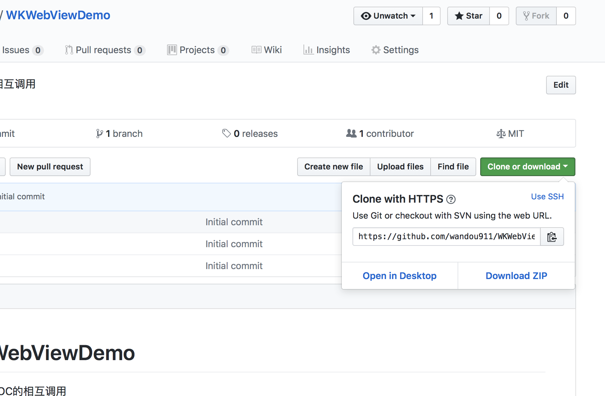

上传已有的iOS项目到GitHub

### 1 在GitHub创建项目

比如现有的iOS项目名称为WKWebViewDemo，就在GitHub创建一个同名的项目



### 2 填写项目信息

填写项目名称 版权等信息



### 3 clone项目到本地

先查看项目地址

打开终端
```
git clone https://github.com/wandou911/WKWebViewDemo.git

```

### 4 copy iOS项目到clone到本机的WKWebViewDemo目录

copy 原有iOS项目 WKWebViewDemo文件夹下的所有内容到从 github clone下来的WKWebViewDemo目录

注意：copy iOS项目WKWebViewDemo文件夹下的所有内容，而不是copyWKWebViewDemo文件夹

### 5 用Xcode打开WKWebViewDemo 


### 6 现在就可以直接用Xcode提交代码的GitHub了


